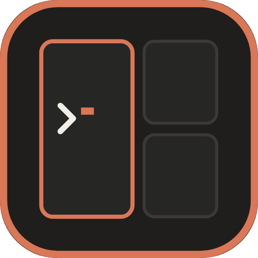

# ClaudeManager

Un desktop per le sessioni di Claude Code su Windows. Una sola finestra a
schermo intero fa da compositor: dentro ci stanno i riquadri delle sessioni,
affiancati in mosaico o staccati come finestre flottanti, ciascuno con il
proprio terminale e il proprio processo `claude`.



## Cosa fa

- **Mosaico e flottanti.** I riquadri si dividono lo spazio automaticamente;
  quello attivo può essere staccato, spostato e ridimensionato col mouse.
- **Selettore di cartella.** `Alt+N` apre una ricerca fuzzy sui progetti, un
  esplora-cartelle e un campo per incollare un percorso, con badge per ramo
  git, presenza di `CLAUDE.md`, sessioni già esistenti e stato di fiducia.
- **Ripresa delle sessioni.** Le conversazioni passate di una cartella sono
  elencate con la loro etichetta e si riaprono con `--resume`.
- **Stato in tempo reale.** Il pallino di ogni riquadro dice se Claude sta
  lavorando o attende input, letto dal registro che Claude Code stesso
  mantiene in `~/.claude/sessions/`.
- **Statistiche di utilizzo.** Token e costo di listino per giorno, modello e
  cartella, ricavati dai transcript.
- **Ripristino del layout.** Alla riapertura torna lo stesso mosaico, con le
  conversazioni riprese dove erano rimaste.

## Scorciatoie

Il modificatore è `Alt`. Il compositor intercetta **solo** le combinazioni
elencate qui: tutto il resto arriva intatto al terminale e quindi a Claude.
Su tastiera italiana `AltGr` genera `Ctrl+Alt` insieme, che non è in mappa,
quindi `@`, `#`, `[`, `]`, `{`, `}` continuano a funzionare normalmente.

| Tasti | Azione |
| --- | --- |
| `Alt+N` | Nuova sessione: apre il selettore di cartella |
| `Alt+Invio` | Nuova sessione nella cartella del riquadro attivo |
| `Alt+B` / `Alt+V` | Nuova sessione affiancata / impilata |
| `Alt+W` | Chiude il riquadro attivo |
| `Alt+F` | Stacca o riaggancia il riquadro attivo |
| `Alt+Z` | Ingrandisce il riquadro attivo a tutto lo spazio |
| `Alt+←→↑↓` | Sposta il fuoco |
| `Alt+Shift+←→↑↓` | Sposta il riquadro nel mosaico |
| `Alt+1` … `Alt+9` | Va alla sessione N |
| `Alt+U` | Pannello statistiche |
| `Alt+,` | Impostazioni |
| `F11` | Schermo intero |
| `Ctrl+Shift+Q` | Esce |

Dentro il selettore: `↑↓` scorre, `Invio` apre, `Ctrl+Invio` entra nella
cartella, `Tab` cambia modo, `Ctrl+D` aggiunge ai preferiti, `Esc` annulla.

## Requisiti

- Windows 10/11 x64
- [Claude Code](https://claude.com/claude-code) installato e raggiungibile
  (`claude` nel PATH, oppure `~/.local/bin/claude.exe`)

## Sviluppo

```powershell
npm install
npm run dev          # avvio con hot reload del renderer
npm run typecheck    # controllo dei tipi di main, preload e renderer
npm run build        # compila in out/
npm run dist         # genera installer NSIS ed eseguibile portabile in release/
```

Variabili d'ambiente utili durante lo sviluppo:

| Variabile | Effetto |
| --- | --- |
| `CM_WINDOWED=1` | Avvia in finestra invece che a schermo intero |
| `CM_DEV_BRIDGE=1` | Abilita il ponte di sviluppo (vedi sotto) |

### Ponte di sviluppo

Con `CM_DEV_BRIDGE=1` l'app legge comandi da
`%APPDATA%\claudemanager\dev-bridge\in.jsonl` (un JSON per riga) e permette di
pilotarla e fotografarla dall'esterno usando le API di Electron, senza rubare
il fuoco al sistema operativo né catturare altro dello schermo. Serve per i
test end-to-end. È disattivato di default e comunque inerte nel pacchetto,
perché il controllo su `app.isPackaged` precede quello sulla variabile.

Comandi accettati: `{"type":"key","key":"b","modifiers":["alt"]}`,
`{"type":"text","text":"..."}`, `{"type":"click","x":0,"y":0}`,
`{"type":"shot","path":"..."}`, `{"type":"eval","js":"...","path":"..."}`.

## Come è fatto

```
src/
  main/          processo principale: possiede i PTY e ogni accesso al disco
    pty/         node-pty, script di bootstrap PowerShell, sanificazione env
    claude/      percorsi, argomenti CLI, transcript, registro sessioni vive
    indexer/     sorgenti dell'indice, punteggio fuzzy, scansione del disco
    usage/       contabilità dei token e tariffe
    store/       configurazione, layout, preferiti (scrittura atomica)
  preload/       unica superficie esposta al renderer, tramite contextBridge
  renderer/      compositor, selettore, pannelli
    compositor/  albero di layout, geometria, riquadri
```

Alcune scelte che non si deducono dal codice:

- **I riquadri hanno un id proprio, distinto da quello del PTY.** Il riquadro
  esiste (ed è misurabile) prima del processo, così il PTY nasce già con le
  dimensioni giuste; e spostare un riquadro nel mosaico non ne cambia la
  chiave React, quindi non ne distrugge il buffer.
- **Le sessioni si correlano per `sessionId`, mai per PID.** Su ConPTY
  `node-pty` riporta pid 0, e un PID può essere riusato.
- **L'ambiente passato al PTY viene ripulito.** Avviando ClaudeManager da
  dentro un terminale Claude Code, `CLAUDE_CODE_CHILD_SESSION` verrebbe
  ereditato e disattiverebbe il salvataggio dei transcript in ogni sessione
  figlia, togliendo le fondamenta a ripresa e statistiche.
- **Gli argomenti di `claude` passano per variabili d'ambiente**, non per la
  riga di comando: elimina i bug di quoting sui percorsi Windows.
- **Il menu predefinito di Electron è rimosso.** Portava `Ctrl+R`, che
  ricaricando il renderer avrebbe azzerato tutti i buffer dei terminali.

## Limiti noti

- Se l'app termina in modo anomalo (crash, `Stop-Process -Force`) le shell dei
  riquadri possono sopravvivere: la pulizia avviene su `before-quit`, che in
  quel caso non viene eseguito. La chiusura normale non lascia processi.
- I costi mostrati sono tariffe API di listino. Con un abbonamento Max o Pro
  non sono spesa reale, ma quanto sarebbe costato lo stesso lavoro via API.
- Gli eseguibili non sono firmati: al primo avvio Windows mostra l'avviso
  SmartScreen.

## Licenza

MIT
